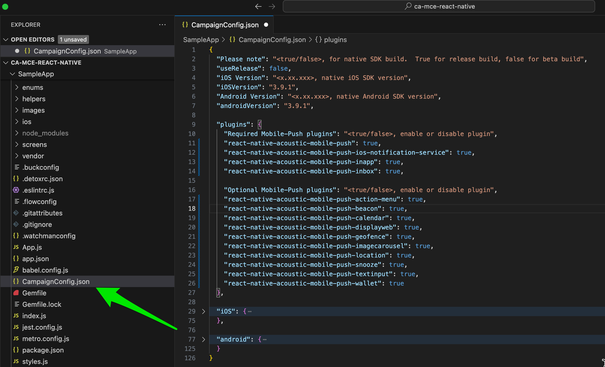

# SampleApp
Contains iOS / Android native applications that build the shared react views [`/screens`] & the sdk plugin(s)

## Build
- Please see React Native's Guide(s) on how to setup your environment: https://reactnative.dev/docs/environment-setup
- Once your environment is setup install the packages - including Sample app and sdk plugins:
	* For more info [Documentation](https://developer.goacoustic.com/acoustic-campaign/docs/add-the-react-native-plug-in-to-your-app)

	* Clone the public beta repo: [GitHub - go-acoustic/Acoustic-Mobile-Push-React-Native at beta](https://github.com/go-acoustic/Acoustic-Mobile-Push-React-Native/tree/beta)
	* `cd SampleApp`
	* `yarn install`

## Google-provided FCM credentials
Copy your _google-services.json_ file with your Google-provided FCM credentials to your android project folder: `android/app/google-services.json`.

## CampaignConfig.json
It is the configuration file for both native iOS/Android platforms.



## Update the iOS configuration file
In the root directory of your app, open the CampaignConfig.json file.
Make sure you are using the right build. During testing, set useRelease to false. For production, use true.
* `"useRelease": true,`
  
Check the version of the Campaign SDK for your iOS app. We recommend using the latest version whenever possible.  Empty defaults to latest.
 * `"iOSVersion": "x.x.x",`

In the iOS section, enter the appKey and baseUrl provided by your account team. Do not change your app key after you publish your app.

```
{
  "baseUrl": "https://mobile-sdk-lib-XX-Y.brilliantcollector.com",
  "appKey": {
    "prod": "INSERT APP KEY HERE"
  }
}
```

## Update the android configuration file
In the root directory of your app, open the CampaignConfig.json file.
Make sure you are using the right build. During testing, set useRelease to false. For production, use true.
* `"useRelease": true,`
  
Check the version of the Campaign SDK for your iOS app. We recommend using the latest version whenever possible.  Empty defaults to latest.
 * `"androidVersion": "x.x.x",`

In the android section, enter the appKey and baseUrl provided by your account team. Do not change your app key after you publish your app.
```
{
  "baseUrl": "https://mobile-sdk-lib-XX-Y.brilliantcollector.com",
  "appKey": {
	"dev": "INSERT YOUR DEV APPKEY HERE",
    "prod": "INSERT APP KEY HERE"
  }
}
```
##  Important: to apply the updates, run the following Node.js command from the project folder.
	`node node_modules/react-native-acoustic-mobile-push/postinstall.js ./`

### Run Android
* `brew install android-platform-tools`
* `npx react-native run-android`

### Run iOS
* `cd ios`
* `pod install`
* `cd ..`
* `npx react-native run-ios`

### Testing the Sample app
Tests are stored in the `SampleApp/e2e` directory. All test files of the form `*.spec.js` will be automatically picked up and run by the CI pipeline.

To run tests, first build the app using the desired configuration using `detox -c [config name] build`, then run the tests using `detox -c [config name] run`.

Available configurations are:
* ios 13-15
* android 21-34

Test results will be placed in `SampleApp/test-results.xml`.


---
# Notes
There are several know issues between npm install versus yarn install. Since yarn is a Facebook tool. It normally has fixes patched for installing dependancies. 